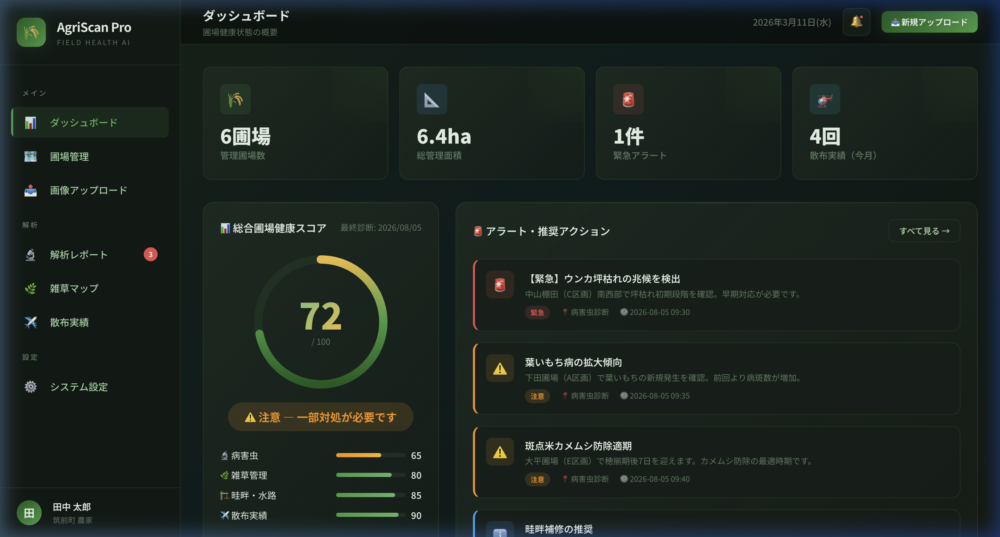
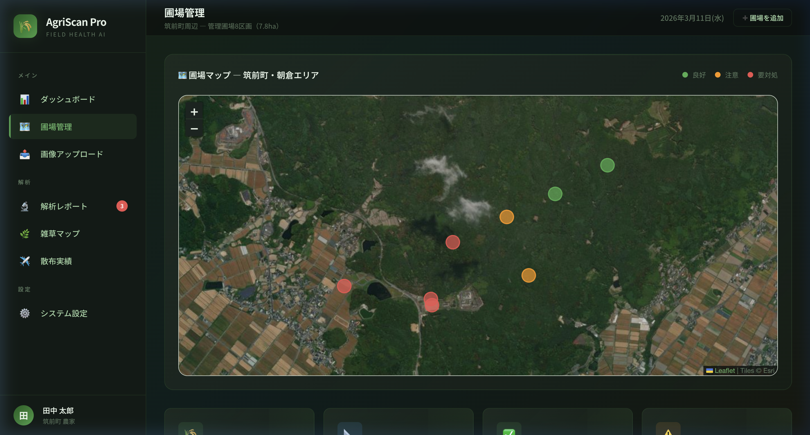
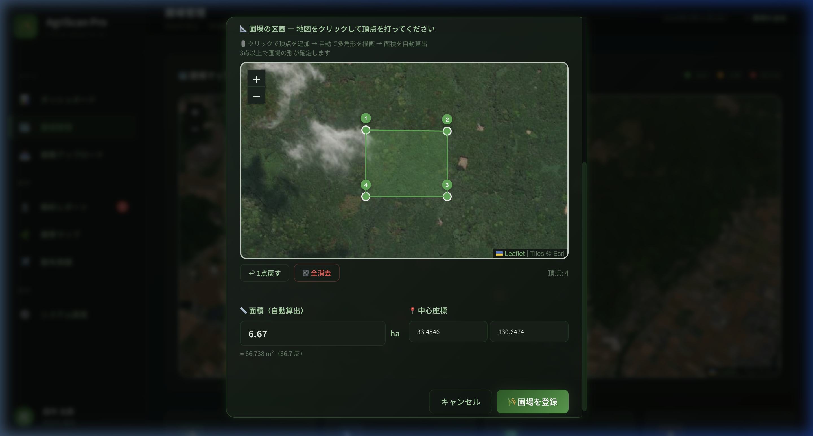

# 🌾 AgriScan Pro

**ドローン画像 × AI解析で圃場管理を次世代へ**

ドローンで撮影した圃場画像をAI（Claude Vision API）で自動解析し、病害虫の早期発見・雑草密度マッピング・インフラ点検を一元管理するWebアプリです。

## ✨ 主な機能

| 機能 | 内容 |
|------|------|
| 🔬 **AI病害虫診断** | 11種の病害虫を画像認識で検出、推奨農薬・緊急度を提示 |
| 🌿 **雑草密度マッピング** | ヒートマップで密度を可視化、重点散布エリアを提案 |
| 🏗️ **インフラ点検** | 畦畔崩れ・水路詰まり・獣害痕を検出 |
| ✈️ **散布品質評価** | 散布ムラの可視化、ルート改善提案 |
| 📐 **ポリゴン描画** | 衛星写真上で圃場を囲んで面積を自動算出（ha/m²/反） |
| 📊 **総合健康スコア** | 0-100の加重平均スコアで圃場の状態を一目で把握 |

## 📸 画面イメージ

| ダッシュボード | 圃場管理（衛星写真） | ポリゴン描画 |
|:---:|:---:|:---:|
|  |  |  |

## 🚀 セットアップ

### 必要なもの
- Python 3.10以降
- インターネット接続（地図タイル取得用）
- Claude APIキー（任意 — なくてもデモモードで動作）

### インストール

```bash
# 1. リポジトリをクローン
git clone https://github.com/JounoFilm/agriscan-pro.git
cd agriscan-pro

# 2. セットアップスクリプトを実行（自動で環境構築）
chmod +x setup.sh
./setup.sh
```

### 起動

```bash
# 基本起動（デモモード）
source backend/venv/bin/activate
python backend/app.py

# AI解析を有効にする場合
export ANTHROPIC_API_KEY=sk-ant-api03-xxxxx
python backend/app.py
```

ブラウザで **http://localhost:5001/** を開いてください。

## 📁 ファイル構成

```
agriscan-pro/
├── index.html              # ダッシュボード
├── upload.html             # 画像アップロード
├── report.html             # 解析レポート
├── fields.html             # 圃場管理
├── css/style.css           # デザイン
├── js/
│   ├── app.js              # メインロジック
│   └── data.js             # デモデータ
├── backend/
│   ├── app.py              # Flask APIサーバー
│   ├── database.py         # SQLite操作
│   ├── analyzer.py         # Claude Vision API連携
│   └── requirements.txt    # Pythonパッケージ
├── docs/                   # 資料・パワーポイント
└── setup.sh                # 自動セットアップ
```

## 🛠️ 技術スタック

- **フロントエンド**: HTML / CSS / JavaScript / Leaflet.js
- **バックエンド**: Python / Flask
- **AI**: Claude Vision API（Anthropic）
- **データベース**: SQLite
- **地図**: Esri World Imagery（無料衛星写真）

## 📍 対象エリア

福岡県筑前町・朝倉エリア（九州地方の稲作に特化）

---

*AgriScan Pro v1.0 — 2026年3月*
