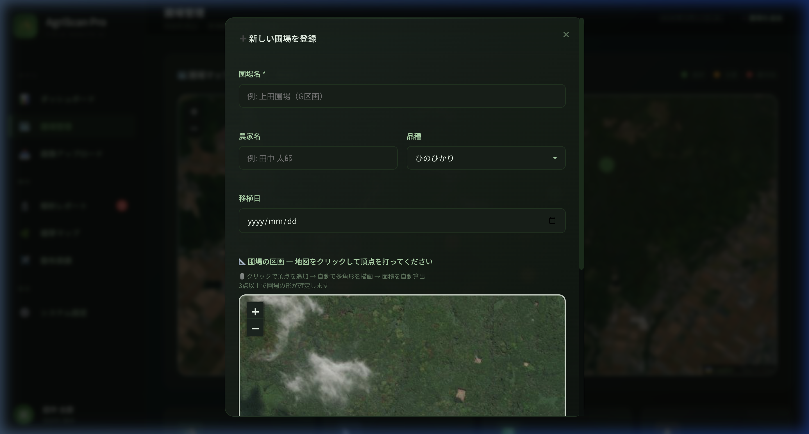

# AgriScan Pro — 操作マニュアル

---

## 目次
1. [起動方法](#1-起動方法)
2. [ダッシュボード](#2-ダッシュボード)
3. [画像アップロード・AI解析](#3-画像アップロードai解析)
4. [解析レポートの見方](#4-解析レポートの見方)
5. [圃場管理](#5-圃場管理)
6. [圃場の追加（ポリゴン描画）](#6-圃場の追加ポリゴン描画)
7. [トラブルシューティング](#7-トラブルシューティング)

---

## 1. 起動方法

### 初回セットアップ

```bash
# 1. プロジェクトフォルダに移動
cd /Users/shuichijouno/Desktop/ドローン農業関連/agriscan-pro

# 2. Python仮想環境を作成（初回のみ）
python3 -m venv backend/venv

# 3. 仮想環境を有効化
source backend/venv/bin/activate

# 4. 依存パッケージをインストール（初回のみ）
pip install -r backend/requirements.txt
```

### 毎回の起動

```bash
# 仮想環境を有効化してサーバー起動
source backend/venv/bin/activate
python backend/app.py
```

起動すると以下が表示されます：

```
============================================================
🌾 AgriScan Pro バックエンド起動
   Claude API: ✅ 有効
   アップロード先: .../backend/uploads
============================================================
 * Running on http://127.0.0.1:5001
```

**ブラウザで http://localhost:5001/ を開いてください。**

### Claude APIキーの設定（AI解析を有効にする）

```bash
# APIキーを環境変数に設定してから起動
export ANTHROPIC_API_KEY=sk-ant-api03-xxxxx
python backend/app.py
```

> ⚠️ APIキーが未設定の場合、デモモードで動作します（サンプルデータが表示）。

---

## 2. ダッシュボード


ダッシュボードでは以下の情報を一覧できます：

| 項目 | 説明 |
|------|------|
| **管理圃場数** | 登録されている圃場の合計数 |
| **総管理面積** | 全圃場の合計面積（ha） |
| **直近14日のアラート** | 緊急対応が必要な検出結果の件数 |
| **前回解析スコア** | 最新の総合健康スコア（0-100） |
| **総合健康スコアリング** | 円形ゲージで健康度を可視化 |
| **緊急アラート** | 病害虫検出で即時対応が必要な項目 |
| **解析モジュール別スコア** | 病害虫・雑草・インフラ・散布の各スコア |

---

## 3. 画像アップロード・AI解析


### 手順

1. サイドバーの「**📤 画像アップロード**」をクリック
2. **画像を選択**：
   - 「ファイルを選択」ボタンをクリック、または
   - 画像ファイルをドラッグ＆ドロップ
   - 対応形式：JPG, PNG, TIFF, WebP, GIF
   - 最大サイズ：50MB
3. **撮影情報を入力**：
   - 圃場（ドロップダウンから選択）
   - 品種、生育ステージ
   - 撮影高度、カメラ情報
   - 直近の天候情報
4. 「**🚀 AI解析を開始**」ボタンをクリック
5. 解析完了まで待機（約10〜30秒）
6. 自動的に解析レポートページに遷移

### 推奨する撮影条件

| 項目 | 推奨値 |
|------|--------|
| 高度 | 15〜30m |
| 時間帯 | 午前9時〜午後3時（影が少ない時間帯） |
| 天候 | 曇り〜晴れ（雨天は避ける） |
| 解像度 | 1cm/px以上（低高度ほど精度向上） |

---

## 4. 解析レポートの見方


### 5つのタブ

#### タブ①：🔬 病害虫
- 検出された病害虫の一覧
- 各項目に**確信度**（%）、**重度**、**被害面積率**を表示
- **推奨農薬**と**緊急度**（即時対応 / 1週間以内 / 経過観察）

#### タブ②：🌿 雑草密度
- 雑草の種類別被覆率
- 10×6マスの**ヒートマップ**（密度が高い箇所が赤く表示）
- 重点散布エリアの提案

#### タブ③：🏗️ インフラ
- 畦畔の崩れ、水路の詰まり等の異常
- 位置情報と重度の表示
- 補修の推奨事項

#### タブ④：✈️ 散布記録
- 過去の散布履歴（薬剤名、散布日、散布量）
- タイムライン形式で表示

#### タブ⑤：📊 総合スコア
- 全モジュールの加重平均スコア（0-100）
- ステータス判定：
  - 🟢 良好（80-100）
  - 🟡 注意（60-79）
  - 🟠 要対処（40-59）
  - 🔴 緊急（0-39）
- 次のアクション一覧（優先度付き）

---

## 5. 圃場管理


### 画面構成

- **衛星写真マップ**：Esri衛星画像で圃場の位置をピン表示
  - 🟢 緑ピン：良好
  - 🟡 黄ピン：注意
  - 🔴 赤ピン：要対処
  - ピンをクリックすると詳細ポップアップ表示
- **統計カード**：管理圃場数、総面積、ステータス別件数
- **圃場カード一覧**：各圃場の名前、農家、面積、品種、健康スコア

---

## 6. 圃場の追加（ポリゴン描画）



### 手順

1. 圃場管理ページの右上「**➕ 圃場を追加**」をクリック
2. 登録フォームに入力：
   - **圃場名**（必須）：例「上田圃場（G区画）」
   - **農家名**：管理者名
   - **品種**：ひのひかり / 元気つくし / 夢つくし / にこまる
   - **移植日**：田植え日
3. **地図をクリックして圃場の境界を描画**：
   - 衛星写真上で田んぼの角を順番にクリック
   - 3点以上で多角形（ポリゴン）が自動描画
   - 面積が**自動算出**（ha / m² / 反）


4. 必要に応じて：
   - 「**↩ 1点戻す**」で最後の頂点を削除
   - 「**🗑 全消去**」でやり直し
5. 「**🌾 圃場を登録**」をクリック

> **💡 ヒント:** ズームイン（＋ボタン）して田んぼの形をしっかり確認しながら頂点を打つと、正確な面積が算出できます。

---

## 7. トラブルシューティング

### サーバーが起動しない

```
OSError: [Errno 48] Address already in use
```
→ ポート5001が他のアプリに使用されています。以下で確認・停止：
```bash
lsof -i :5001
kill -9 <PID>
```

### 「Claude API: ❌ 無効」と表示される

→ APIキーが設定されていません。起動前に以下を実行：
```bash
export ANTHROPIC_API_KEY=sk-ant-api03-xxxxx
```

### 画像アップロードでエラーが出る

| エラー | 原因 | 対処 |
|--------|------|------|
| 「画像ファイルが必要です」 | ファイル未選択 | 画像を選択してください |
| 「有効な画像ファイルがありません」 | 非対応形式 | JPG/PNG/TIFF/WebP形式にしてください |
| 413エラー | ファイルが大きすぎる | 50MB以下にリサイズしてください |

### マップが表示されない

→ インターネット接続を確認してください。衛星写真タイルはネット経由で取得しています。

### デモモードから抜け出せない

→ APIキーを設定後、サーバーの再起動が必要です：
```bash
# Ctrl+C でサーバー停止
export ANTHROPIC_API_KEY=sk-ant-api03-xxxxx
python backend/app.py
```

---

## クイックリファレンス

| 操作 | URL |
|------|-----|
| ダッシュボード | http://localhost:5001/ |
| 画像アップロード | http://localhost:5001/upload.html |
| 解析レポート | http://localhost:5001/report.html |
| 圃場管理 | http://localhost:5001/fields.html |
| API状態確認 | http://localhost:5001/api/status |

---

*AgriScan Pro v1.0 操作マニュアル — 2026年3月*
