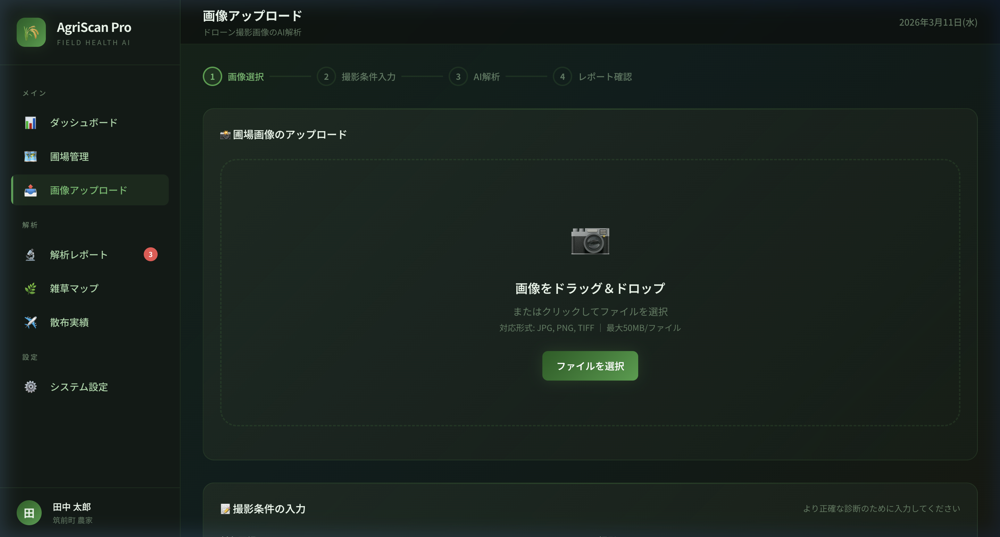
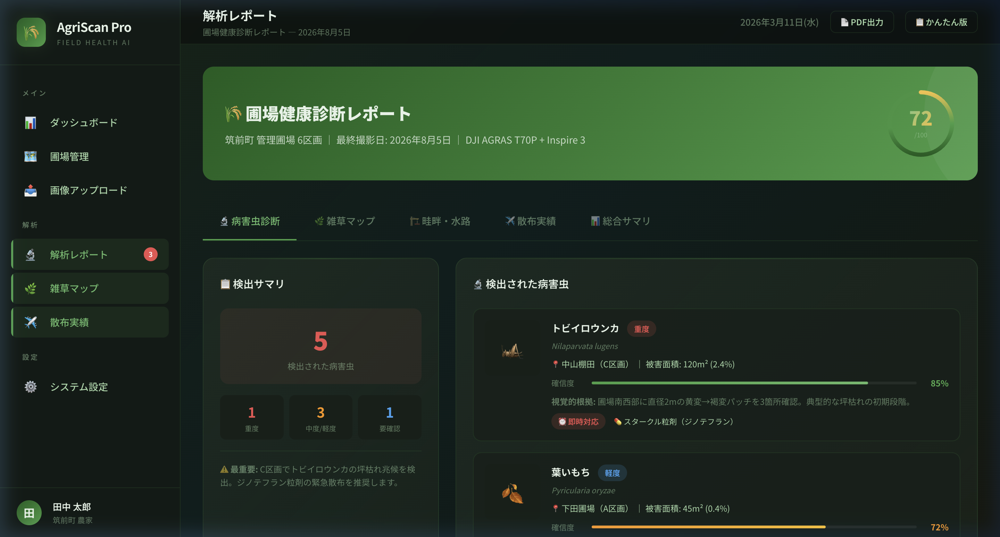

# AgriScan Pro — アプリケーション概要資料

**ドローン画像×AI解析で圃場管理を次世代へ**

---

## 1. AgriScan Pro とは

AgriScan Proは、ドローンで撮影した圃場画像をAI（Claude Vision API）で自動解析し、 病害虫の早期発見・雑草密度の把握・インフラ点検・散布品質の評価を一元管理するWebアプリケーションです。

福岡県筑前町をモデルエリアとして設計しており、九州地方の稲作（ひのひかり・元気つくし・夢つくし）に特化した解析プロンプトを搭載しています。

---

## 2. 主な機能

### 🔬 AI病害虫診断
| 項目 | 内容 |
|------|------|
| 対応病害 | いもち病（葉・穂・首）、紋枯病、白葉枯病、縞葉枯病、細菌性穀枯病 |
| 対応害虫 | トビイロウンカ、セジロウンカ、イネカメムシ、クモヘリカメムシ、ニカメイチュウ、イネドロオイムシ |
| 出力 | 病害虫名、確信度（%）、被害面積率、重度判定、推奨農薬、緊急度 |

### 🌿 雑草密度マッピング
- ノビエ・コナギ・ホタルイ等を種別に検出
- 10×6セルの密度ヒートマップを生成
- 全体被覆率（%）と重点散布エリアを提示

### 🏗️ インフラ点検（畦畔・水路）
- 畦畔の崩れ・侵食の検出
- 水路の詰まり・藻類繁殖の確認
- 獣害痕（イノシシ・シカ）の検出

### ✈️ 散布品質評価
- 散布ムラ・未散布エリアの可視化
- 散布均一性スコアの算出
- 次回散布のルート改善提案

### 📊 総合健康スコア（0-100）
- 5モジュールの加重平均で算出
- 良好（80-100）/ 注意（60-79）/ 要対処（40-59）/ 緊急（0-39）の4段階評価

---

## 3. 画面構成

### ダッシュボード
全圃場の健康状態、緊急アラート、解析モジュール別スコアを一覧表示。


### 画像アップロード
ドローン画像のドラッグ&ドロップ、撮影条件の入力、AI解析の実行。



### 解析レポート
5つのタブ（病害虫・雑草・インフラ・散布・総合）で詳細結果を表示。



### 圃場管理
衛星写真マップ上で圃場の位置・状態を管理。ポリゴン描画で面積を自動算出。


---

## 4. 技術構成

```
┌─────────────────────────────────┐
│  フロントエンド                     │
│  HTML / CSS / JavaScript         │
│  Leaflet.js（衛星写真マップ）       │
└──────────┬──────────────────────┘
           │  REST API
┌──────────▼──────────────────────┐
│  バックエンド                      │
│  Python / Flask                  │
│  Claude Vision API（Anthropic）   │
│  SQLite（データ永続化）             │
└─────────────────────────────────┘
```

| レイヤー        | 技術                     | 役割                         |
|---------------|--------------------------|------------------------------|
| フロントエンド   | HTML/CSS/JS, Leaflet.js  | UI、地図表示、画像アップロード    |
| バックエンド     | Python, Flask            | API、画像処理、DB管理          |
| AI解析          | Claude Vision API        | 画像認識、病害虫判定、レポート生成 |
| データベース     | SQLite                   | 圃場情報、解析結果の永続化       |
| 地図タイル       | Esri World Imagery       | 衛星写真（無料）                |

---

## 5. 対応環境

| 項目 | 要件 |
|------|------|
| サーバー | Python 3.10以降、pip |
| ブラウザ | Chrome / Safari / Edge（最新版） |
| ドローン | DJI AGRAS T70P / Matrice 4TD 等（JPEG/PNG画像出力可能な機体） |
| API | Anthropic Claude API キー（有料、新規$5無料枠あり） |
| 通信 | インターネット接続必須（AIモード使用時） |

---

## 6. コスト目安

| 項目 | 費用 |
|------|------|
| ソフトウェア | 無料（オープンソース） |
| Claude API | 約¥5〜15/回（画像1枚あたり） |
| 地図タイル | 無料（Esri World Imagery） |
| サーバー | ローカル動作（追加費用なし） |

**月間100回解析の場合：約¥500〜1,500/月**

---

## 7. 今後の拡張予定

- [ ] RTK基準局データ連携（±2cm精度の圃場境界特定）
- [ ] 時系列変化トラッキング（過去画像との比較）
- [ ] LINEアラート通知（緊急検出時の自動通知）
- [ ] マルチユーザー対応（複数農家の圃場管理）
- [ ] 気象データ連携（気象庁API / JMA）
- [ ] ドローン散布計画の自動生成

---

*AgriScan Pro v1.0 — 2026年3月*
*開発元: AgriScan Project / 対象地域: 福岡県筑前町・朝倉エリア*
